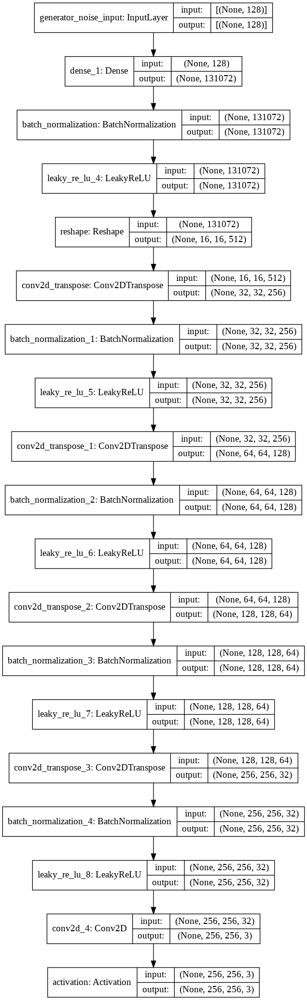
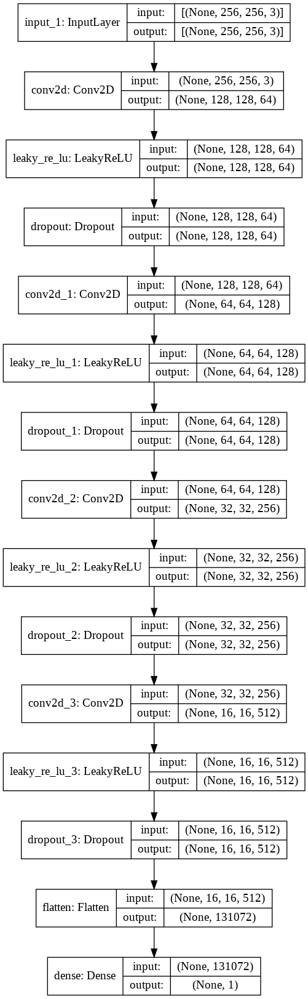

# Generate-Abstract-Images

> Generating Abstract Images using DCGANs

## Demo

https://user-images.githubusercontent.com/41967348/131220739-2e0204ae-ace0-42be-a8eb-d39461b0c44a.mp4

## Models

* Generator

* Discriminator

